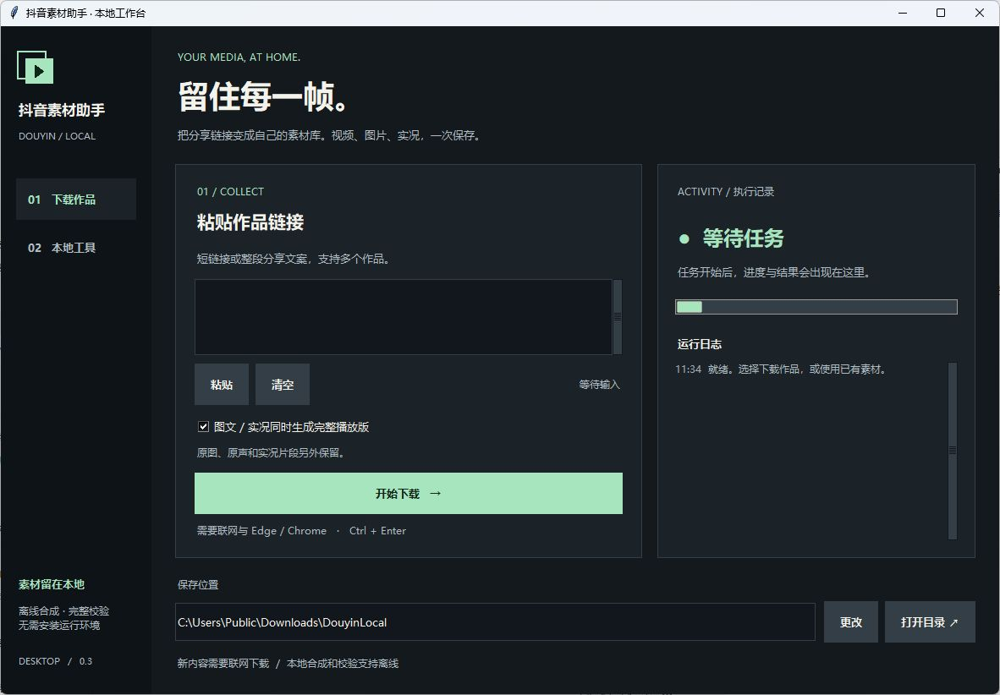
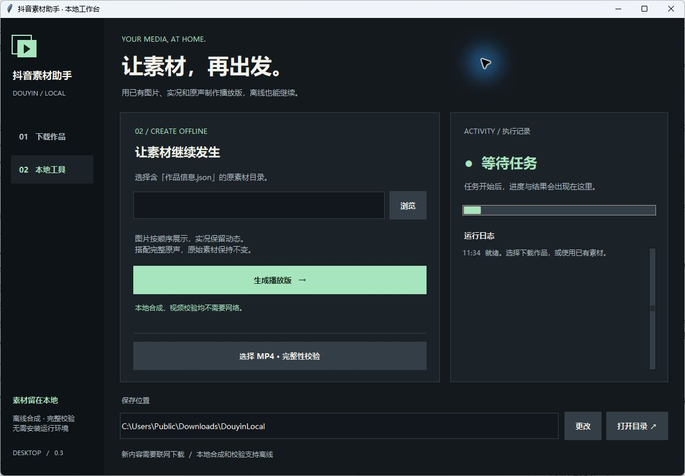

# 抖音素材助手

**把分享链接，变成本地素材。**

Windows 桌面工具，支持抖音视频、图文和实况作品。保留原图、原声、实况片段，按需合成完整播放版；已有素材可以离线处理。

[](https://github.com/carpentry-liu/douyin-downloader/actions/workflows/test.yml)
[](LICENSE)



## 能做什么

| 输入 | 保存结果 |
|---|---|
| 普通视频 | MP4 + 完整性校验记录 |
| 图文 | 每张平台原图、原声、作品信息清单 |
| 实况图文 | 原图、每张对应的实况 MP4、原声和清单 |
| 本地素材目录 | 配上完整原声的 H.264/AAC 播放版 |
| 本地 MP4 | 完整解码、时长、分辨率和 SHA-256 校验 |

- 支持整段分享文案和多个链接，自动去重、串行处理。
- 图文按原顺序展示，实况保持动态并循环，完整保留原声时长；无原声时每项 5 秒。
- 合成版明确标记为本地生成，原始文件另外保留，画面留边不裁剪。
- 重复任务检查已有文件哈希；同名文件不匹配时停止，避免覆盖。
- 深色工作台、剪贴板粘贴、链接计数、任务反馈；`Ctrl+Enter` 开始下载。

**新下载需要网络与系统 Edge/Chrome；启动、已有素材合成和视频校验可以离线使用。**

## 快速运行

需要 Windows 64 位、Python 3.12+。本仓库提供源码，依赖首次安装需要网络。

```powershell
git clone https://github.com/carpentry-liu/douyin-downloader.git
cd douyin-downloader
py -3.12 -m venv .venv
.venv\Scripts\python.exe -m pip install -e .
.venv\Scripts\python.exe scripts\portable_entry.py
```

1. 选择「下载作品」，粘贴抖音链接或分享文案。
2. 选择保存位置，按需勾选生成完整播放版，点击「开始下载」。
3. 完成后打开保存目录；素材与校验信息一起保存。

源码运行默认保存到项目 `downloads`。免安装 EXE 默认保存到 EXE 旁的 `downloads`，也可以更改位置。程序使用独立的临时浏览器，不读取日常浏览器登录资料。

## 离线工具

进入「本地工具」，选择包含 **作品信息.json 和完整原素材** 的目录，点击「生成播放版」。选择 MP4 可以执行完整解码校验。不要单独移动清单或修改原素材。



## 构建单文件 EXE

在已经安装项目依赖的 Windows 环境执行：

```powershell
.venv\Scripts\python.exe -m pip install -r requirements-build.txt
.venv\Scripts\python.exe scripts\build_portable.py
```

生成 `dist/DouyinLocal.exe`、`使用说明.txt`、哈希记录和第三方许可。EXE 自带 Python、Tk、Playwright 驱动和 FFmpeg，可以单独移动，不要求目标电脑安装 Python；首次启动需要数秒解包。联网解析仍需要系统 Edge/Chrome。

当前公开源码，不在 Releases 提供包含 FFmpeg 的整合二进制。自行构建可在本机使用；若对外再分发，需满足第三方组件的许可与对应源码要求，详见 [THIRD_PARTY.md](THIRD_PARTY.md)。

## 命令行

```powershell
# 普通视频、图文和实况；把占位文案换成实际分享内容
.venv\Scripts\python.exe scripts\portable_entry.py --download "你的抖音分享链接" --output downloads

# 仅保存原素材，不生成合成版
.venv\Scripts\python.exe scripts\portable_entry.py --download "你的抖音分享链接" --originals-only

# 本地处理
.venv\Scripts\python.exe scripts\portable_entry.py --compose "素材目录" --offline --output output
.venv\Scripts\python.exe scripts\portable_entry.py --verify "已有视频.mp4" --offline
```

窗口版 EXE 支持同样参数，添加 `--report report.json` 可保存结构化结果。旧 `download.cmd` 和 `python -m douyin_local` 保留，只处理普通视频。

## 验证

```powershell
.venv\Scripts\python.exe -m unittest discover -s tests -v
.venv\Scripts\python.exe -m pip check
.venv\Scripts\python.exe scripts\portable_entry.py --self-test --report .local\selftest.json

# 构建后，在独立目录使用生成的测试素材验收成品
.venv\Scripts\python.exe scripts\verify_portable.py
# 可选：再用自己的真实链接联网验收
.venv\Scripts\python.exe scripts\verify_portable.py --online-url "你的抖音分享链接"
```

测试覆盖真实本地 HTTP 传输、解码、目标 ID 匹配、图文解析、实况顺序、离线合成、防覆盖和 GUI 任务状态。夹具自动生成，不需要私人下载文件。`--offline` 用于程序级离线验收：阻断 Python 外部连接及 HTTP 代理连接，允许本机 IPC，浏览器自检使用离线上下文；不修改系统网络配置。

## 当前边界

- 支持单篇作品和多条分享链接，暂不支持主页抓取、直播、账号登录或验证码处理。
- 平台页面、内容权限和风控可能变化，不能保证所有链接均可匿名下载；失败会显示原因。
- 优先选择平台当前可用的 H.264 视频；图片保留平台返回的格式与尺寸，不承诺创作者上传源文件或 4K。
- 不去除画面内已有水印。请下载自己有权保存和使用的内容。
- Windows 为桌面支持目标；尚未验证其他系统的 GUI。下载中断后重新运行，目前不保留跨进程续传文件。

## 开源与贡献

自研代码采用 [MIT](LICENSE)，第三方组件保留各自许可。

- [架构与边界](docs/architecture.md)
- [贡献指南](CONTRIBUTING.md)
- [代码审查记录](docs/review.md)
- [验证记录](docs/validation.md)
- [问题反馈](https://github.com/carpentry-liu/douyin-downloader/issues)
